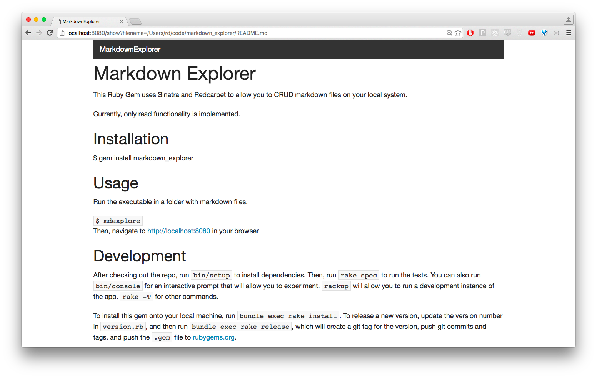

# MarkdownExplorer

This Ruby Gem uses Sinatra and Redcarpet to allow you to CRUD markdown files on your local system.

Currently, only read functionality is implemented.


## Installation

```bash
$ gem install markdown_explorer
```


## Usage

Run the executable in a folder with markdown files.

```bash
$ mdexplore
```

Then, navigate to <http://localhost:8080> in your browser




## Development

```bash
$ cd markdown_explorer
$ ./bin/setup      # install dependencies
$ rake spec        # run the test suite
$ ./bin/console    # open the interactive prompt
$ ./exe/mdexplore  # run the application
$ rake -T          # view rake commands
```

Other commands:

```bash
$ rake install:local  # install gem locally
$ rake release        # release to RubyGems.org (bump version.rb, first)
```


## TODO

* Create markdown files in browser
* Edit/update markdown files in the browser
* Delete markdown files from the browser
* Create a better navigation system (tree view)


## Contributing

Bug reports and pull requests are welcome on GitHub at https://github.com/LaunchAcademy/markdown_explorer. Use the [fork-and-branch](http://blog.scottlowe.org/2015/01/27/using-fork-branch-git-workflow/) workflow to contribute.

This project is intended to be a safe, welcoming space for collaboration, and contributors are expected to adhere to the [Contributor Covenant](http://contributor-covenant.org) code of conduct.


## License

The gem is available as open source under the terms of the [MIT License](http://opensource.org/licenses/MIT).

